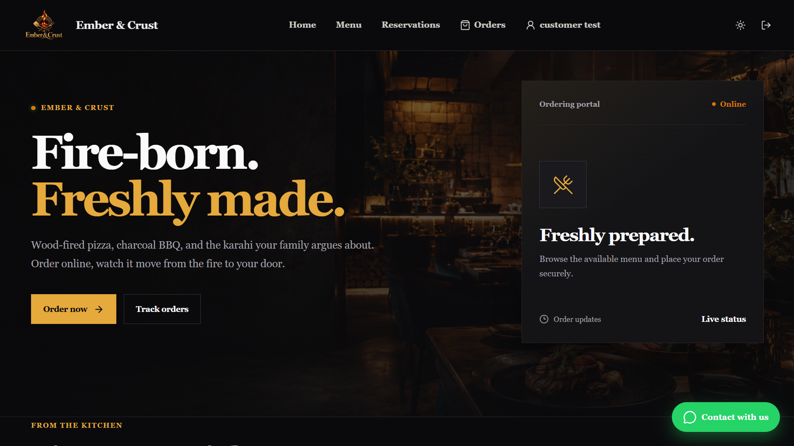
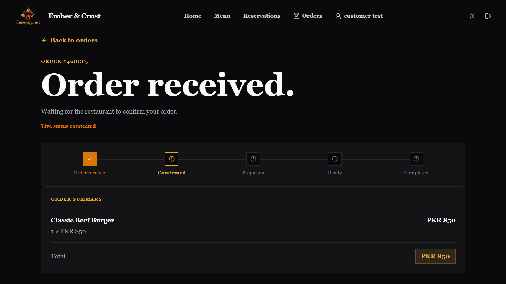
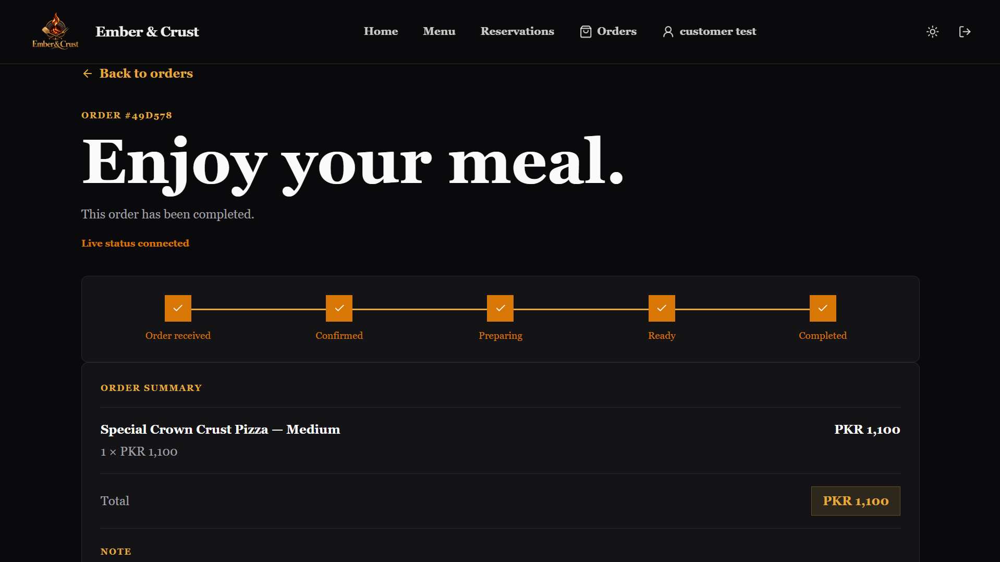
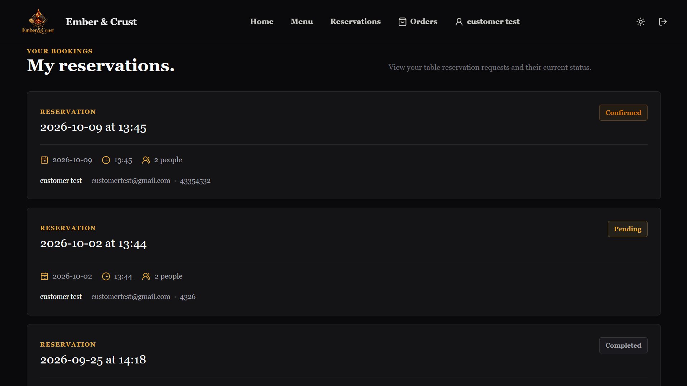
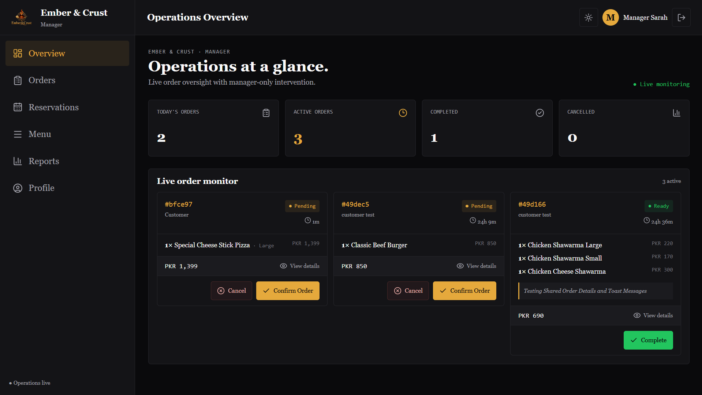
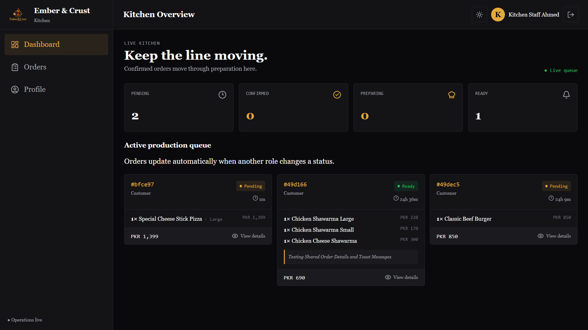
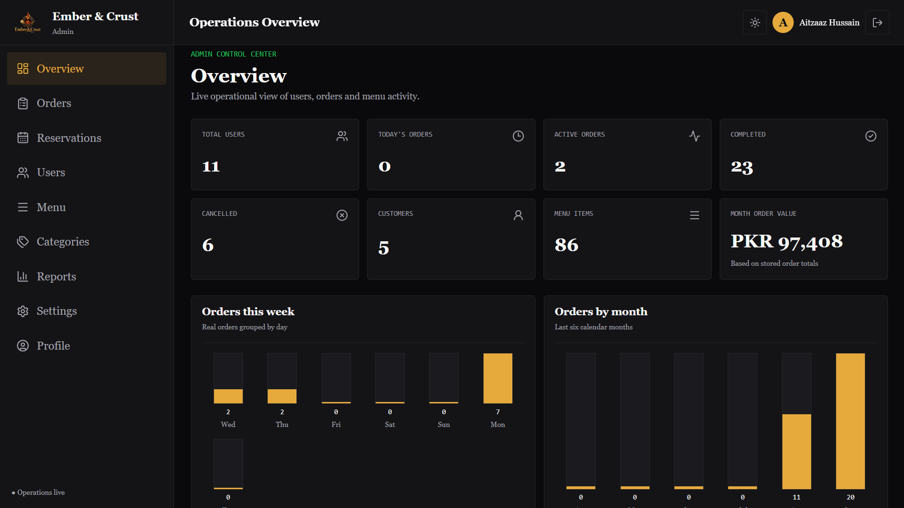

<div align="center">

# Aitzaaz | Web Systems


### I build custom web systems around real business problems.

**Web Apps · Customer Flows · Business Automation**

<br />

<a href="https://aitzaazhussain.vercel.app"></a>
<a href="mailto:hello.aitzaazhussain@gmail.com"></a>
<a href="https://www.instagram.com/aitzaazhussain/"></a>

</div>

---

## 🧭 Identity

I'm **Aitzaaz Hussain** — a web systems builder focused on turning real business problems into practical digital systems.

I don't build software simply because a technology is interesting.

I start by understanding **where the friction is**.

Then I design and build the system around it.

My work sits between:

**Business problem → Customer experience → System design → Software → Automation**

---

## 🎯 Position

I build **custom web systems** around real business problems.

That means websites, web applications, internal tools and automation — designed around how a business actually runs, not around whichever technology happens to be interesting.

`Web Apps` · `Customer Flows` · `Business Automation`

---

## 🧩 Problem

Businesses often don't have one big technology problem.

They have a collection of small problems that create friction:

- Customers don't know where to go.
- Important actions are buried behind multiple links.
- Bookings or orders depend on disconnected tools.
- Staff repeat manual work.
- Internal operations lack visibility.
- Customer-facing experiences don't match the quality of the business.

A website alone isn't always the solution. Sometimes the real problem is the **system around the website**.

A customer may discover a business through Instagram, then open a bio link, then find another platform, then find a booking page, then receive a confirmation somewhere else. Meanwhile, the business may be managing orders, reservations, customers and operations across completely separate tools.

---

## ⚙️ Solution

I look for the friction between the pieces. Then I build a clearer path.

```text
CUSTOMER
   ↓
DISCOVERS BUSINESS
   ↓
TAKES ACTION
   ↓
SYSTEM PROCESSES ACTION
   ↓
BUSINESS TEAM RESPONDS
   ↓
CUSTOMER GETS UPDATED
```

The goal is not simply to add more software.

The goal is to make the whole journey **clearer, faster and easier to manage**.

---

## 🧠 How I Think

Good software isn't just about whether the code works. It also has to make sense to the person using it.

| | Principle | The question I ask |
|---|---|---|
| 🔍 | **Clarity** | Can the user understand what to do? |
| 🌊 | **Flow** | Can they complete the task without unnecessary friction? |
| 🛡️ | **Reliability** | Does the system behave correctly when things go wrong? |
| 🔧 | **Maintainability** | Can the system continue to evolve? |
| 💰 | **Business value** | Does the software solve an actual problem? |

That is the difference between building a feature and building a useful system.

### The loop I follow

```text
OBSERVE  →  Find the actual problem
DEFINE   →  Turn the problem into a clear system
DESIGN   →  Map the customer and business flow
BUILD    →  Implement the smallest useful solution
TEST     →  Break it, inspect it, fix it
REFINE   →  Remove unnecessary friction
SHIP     →  Put the system into the real world
```

And then the cycle starts again. Because the first version is rarely the final version.

> **Start with the problem. Not the technology.**
> Make the complicated part invisible to the user.
> A feature isn't finished when the code works. It's finished when the experience makes sense.
> Build. Test. Break. Fix. Repeat.

---

## 🔨 Real Proof

### Restaurant Operations — Live Order Control

**A full restaurant operations system.**

Built and demonstrated through **Ember & Crust**, a complete branded demo restaurant environment — its identity, branding, menu, UI, customer experience and operational workflows.

One project. One system. Ember & Crust is the branded implementation.

The system connects customer-facing experiences with internal restaurant operations across four roles: **Customer · Kitchen · Manager · Admin**.

### 📸 Live product screens

<p align="center">
  
  <br /><sub><b>Customer home</b> — Ember & Crust storefront</sub>
</p>

<table>
  <tr>
    <td width="50%" align="center">
      
      <br /><sub><b>Live order status</b> — order received, waiting for the restaurant</sub>
    </td>
    <td width="50%" align="center">
      
      <br /><sub><b>Live order status</b> — the order, completed</sub>
    </td>
  </tr>
  <tr>
    <td colspan="2" align="center">
      
      <br /><sub><b>Reservations</b> — confirmed · pending · completed</sub>
    </td>
  </tr>
  <tr>
    <td width="50%" align="center">
      
      <br /><sub><b>Manager dashboard</b> — live order monitor and confirmations</sub>
    </td>
    <td width="50%" align="center">
      
      <br /><sub><b>Kitchen dashboard</b> — active production queue</sub>
    </td>
  </tr>
  <tr>
    <td colspan="2" align="center">
      
      <br /><sub><b>Admin dashboard</b> — operations overview and analytics</sub>
    </td>
  </tr>
</table>


**Customer experience**

`Menu` → `Ordering` → `Order Status` → `Reservations` → `Account`

**Operations**

`Orders` → `Kitchen` → `Management` → `Reservations`

**Core capabilities**

- Customer authentication
- Role-based access
- Menu management
- Ordering workflows
- Order lifecycle management
- Kitchen operations
- Reservation requests
- Reservation management
- Customer reservation history
- Manager workflows
- Real-time Socket.IO communication
- JWT authentication
- MongoDB persistence

**Architecture**

A master codebase is designed to be deployed independently for each restaurant brand, with a separate database for each deployment rather than a shared multi-tenant database.

**Stack**

`React` `Vite` `Node.js` `Express` `MongoDB` `Mongoose` `Socket.IO` `JWT` `bcrypt`

**Demo restaurant:** Ember & Crust

<div align="center">

<a href="https://aitzaazhussain.vercel.app"></a>

</div>

---

## 🛠️ What I Build

| | System | What it does |
|---|---|---|
| 🌐 | **Modern Business Websites** | Clear digital presence built around what customers actually need to do. |
| 📱 | **Web Applications** | Custom applications designed around specific business workflows. |
| 🛒 | **Ordering Systems** | Customer ordering experiences connected to operational workflows. |
| 📅 | **Booking & Reservation Systems** | Structured booking flows with management visibility. |
| 📊 | **Business Dashboards** | Internal tools that make important information easier to manage. |
| ⚙️ | **Business Automation** | Removing repetitive steps and connecting disconnected processes. |
| 🤖 | **AI-Powered Workflows** | Practical AI integration where it actually improves the workflow. |

---

## 💻 Technical Credibility

| Layer | Stack |
|---|---|
| **Frontend** | React · Next.js · Vite · JavaScript · TypeScript · HTML · CSS |
| **Backend** | Node.js · Express · REST APIs · Socket.IO |
| **Databases & Auth** | MongoDB · Mongoose · Supabase · JWT · bcrypt |
| **Deployment & Tools** | Vercel · Git · GitHub · Figma |
| **Automation & AI** | OpenAI API · n8n |

---

## 🌍 Who I Work With

I work with businesses, founders and teams that need more than a generic website.

- A business that needs a stronger digital customer journey
- A company replacing disconnected manual workflows
- A founder validating a digital product
- A business needing a custom internal tool
- A team that needs a web application built around a specific workflow
- A business looking to automate repetitive operations

**🌍 US · UK · Worldwide**

---

## 🌐 Elsewhere

<table>
  <tr>
    <td align="right" width="26%"><b>🥇&nbsp;Primary</b></td>
    <td>
      <a href="https://aitzaazhussain.vercel.app"></a>
      <a href="mailto:hello.aitzaazhussain@gmail.com"></a>
    </td>
  </tr>
  <tr>
    <td align="right"><b>💼&nbsp;Professional</b></td>
    <td>
      <a href="https://www.linkedin.com/in/aitzaazhussain/"></a>
      <a href="https://github.com/aitzaazhussain"></a>
    </td>
  </tr>
  <tr>
    <td align="right"><b>📱&nbsp;Build&nbsp;&amp;&nbsp;Content</b></td>
    <td>
      <a href="https://www.instagram.com/aitzaazhussain/"></a>
      <a href="https://www.tiktok.com/@aitzaazhussain"></a>
      <a href="https://www.facebook.com/aitzaazhussain.web"></a>
    </td>
  </tr>
  <tr>
    <td align="right"><b>💻&nbsp;Marketplaces</b></td>
    <td>
      <a href="https://www.upwork.com/freelancers/~017909d227afb10dfb"></a>
      <a href="https://www.fiverr.com/aitzaazhussain"></a>
    </td>
  </tr>
  <tr>
    <td align="right"><b>🔗 More</b></td>
    <td>
      <a href="https://x.com/aitzaazweb"></a>
      <a href="https://www.threads.net/@aitzaazhussain"></a>
    </td>
  </tr>
</table>

---

## 🤝 Hire / Contact

If you have a business problem, a workflow that needs fixing, a product idea that needs building, or a system that needs to become simpler — let's talk.

I can start with the problem and work toward the appropriate solution — whether that's a website, web application, internal dashboard, customer flow, automation, or a combination of systems.

<div align="center">

<a href="mailto:hello.aitzaazhussain@gmail.com"></a>
<a href="https://aitzaazhussain.vercel.app"></a>

<br /><br />

📧 **hello.aitzaazhussain@gmail.com**

<br />

**Aitzaaz | Web Systems**

*Build with purpose. Ship with patience. InshaAllah, keep going.*

</div>
